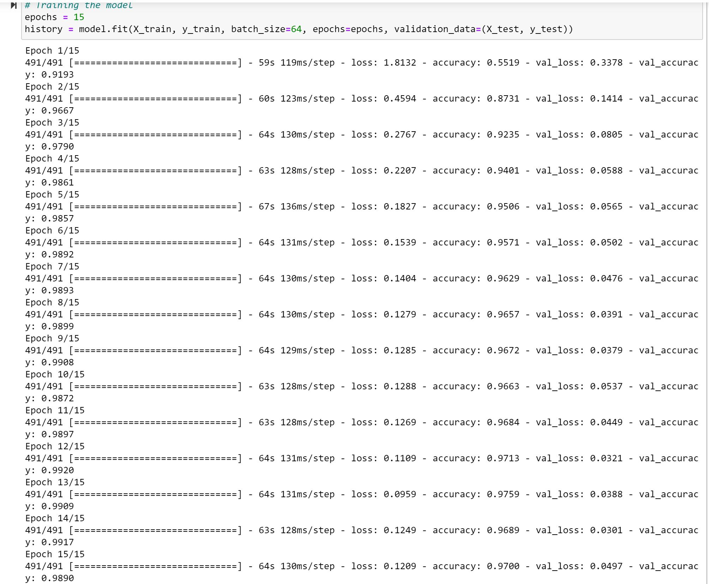
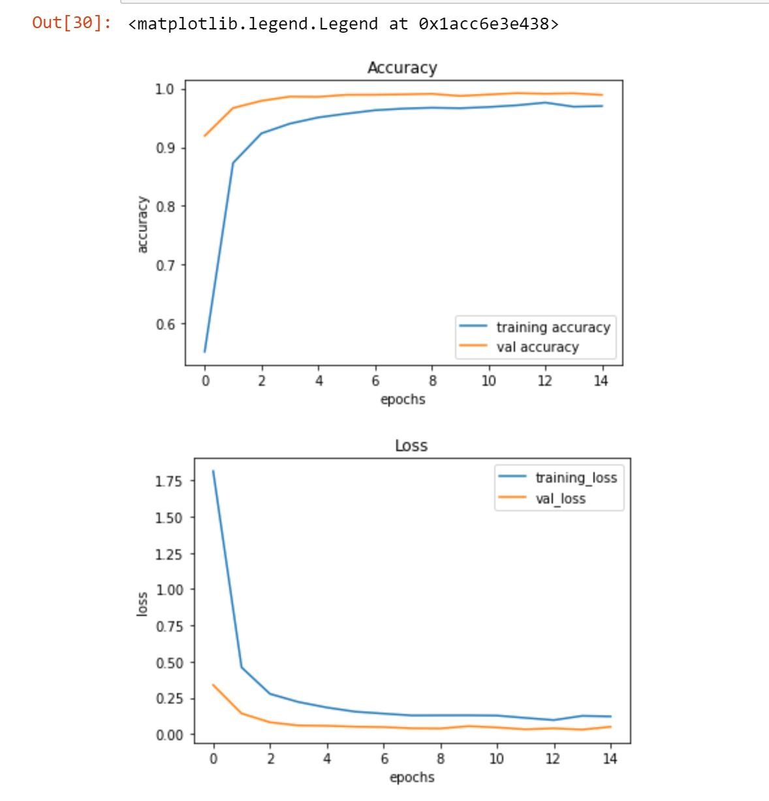
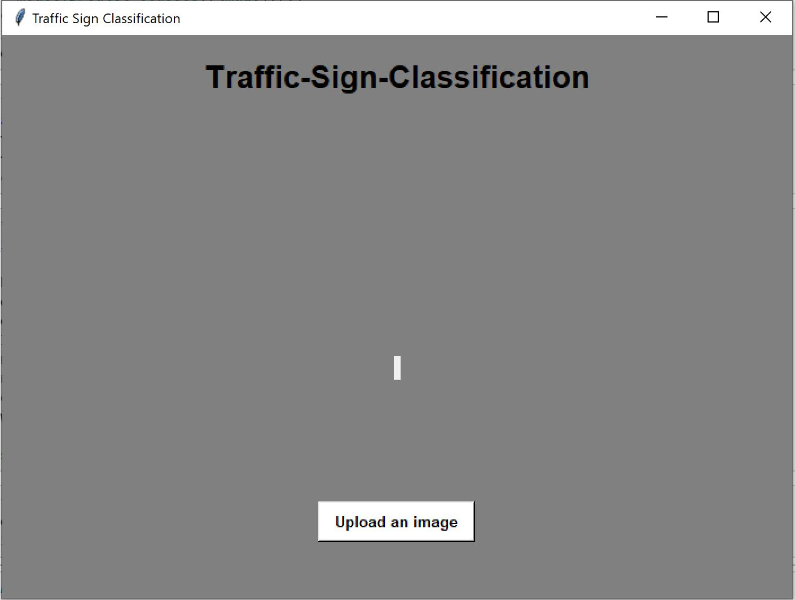
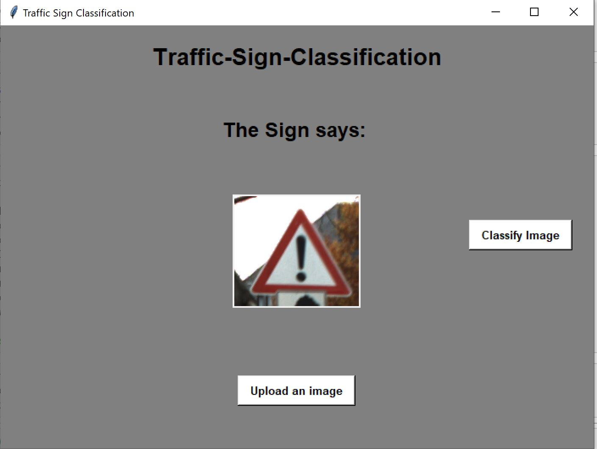

# Traffic-Sign-Classification
This is a small project of multi-class image classification.  
The dataset used here is the "German Traffic Sign Recognition Benchmark" Dataset from Kaggle and can be found at https://www.kaggle.com/meowmeowmeowmeowmeow/gtsrb-german-traffic-sign. 
The dataset contains more than 50000 images of various traffic signs which are classified into 43 classes.  
The packages used to develop this project are tensorflow, keras, sklearn, matplotlib, pandas, PIL and tkinter.  
The CNN model is used for the classification of the images. The architecture of the model and its layers can be found in "traffic-sign-classifier.ipynb" file.  
The accuracy achieved after training 15 epochs with batch_size of 64 on the training data is 97%.  
The trained model can be found as the "traffic-sign-classifier.h5" file.  

The Training Result: 
  
Training_Accuracy vs Validation_Accuracy & Training_Loss vs Validation_Loss is plotted and can be visualized as: 
  
GUI Screenshots: 
The GUI before uploading the image: 
  
The GUI after uploading the image: 
  
Classification: 
  
